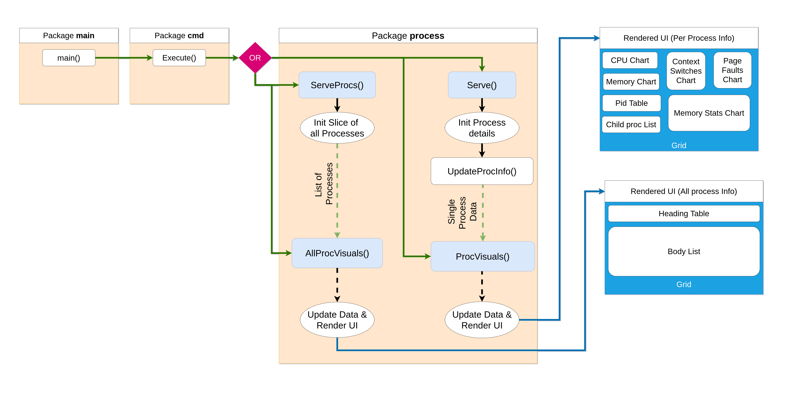

Program Architecture
====================

Legend
------

| Diagram                                                                       | Name                |
|-------------------------------------------------------------------------------|---------------------|
|        | Go Package          |
|       | Function            |
|  | Concurrent Function |
|  | Function call       |
|    | Channel             |
|     | Action              |
|         | UI                  |

-	**Go Package**: This is the Go equivalent of a "library" or "module", it is a collection of functions, variables, types and other definitions.

-	**Function**: Nothing new here, just a plain old function.

-	**Concurrent Function**: In reality this is just a simple function too, the only difference is that when called it doesn't execute sequentially, it creates a routine (Kind of like a thread) and runs on it's own while the block that called the function can continue to execute.

-	**Function Call**: This indicates that a function call was made, the function it points to is the function being called.

-	**Channel**: Channels are used for communication between Go Routines. It helps transfer data across routines safely.

-	**Action**: An action in the diagram is just an abstraction made for *something* (some sort of task) being done. In reality it could be some processing, function calls, etc.

-	**UI**: UI depicts the UI visible to the user, it consists of widgets which are rendered to show something meaningful to the user.

Overall Metrics
---------------

Called when executing `grofer`

---

Process Metrics
---------------

Called when executing `grofer proc [-p pid]`

