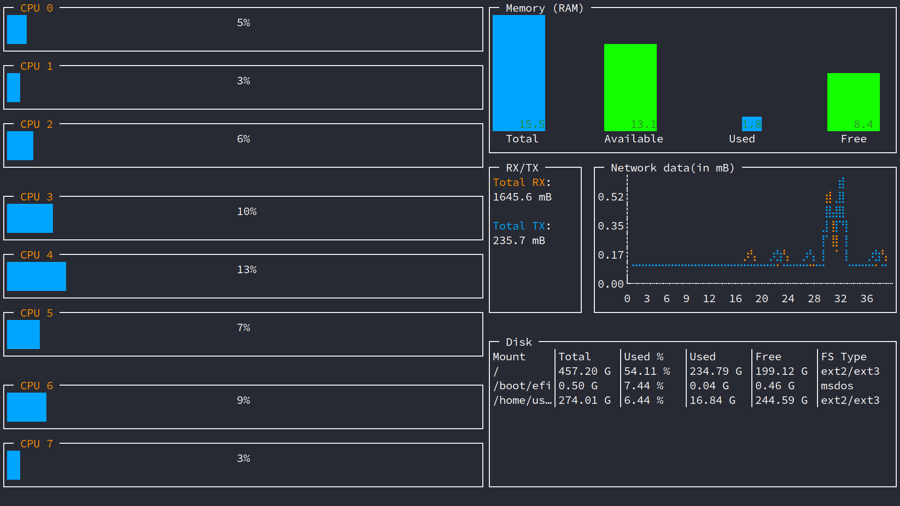
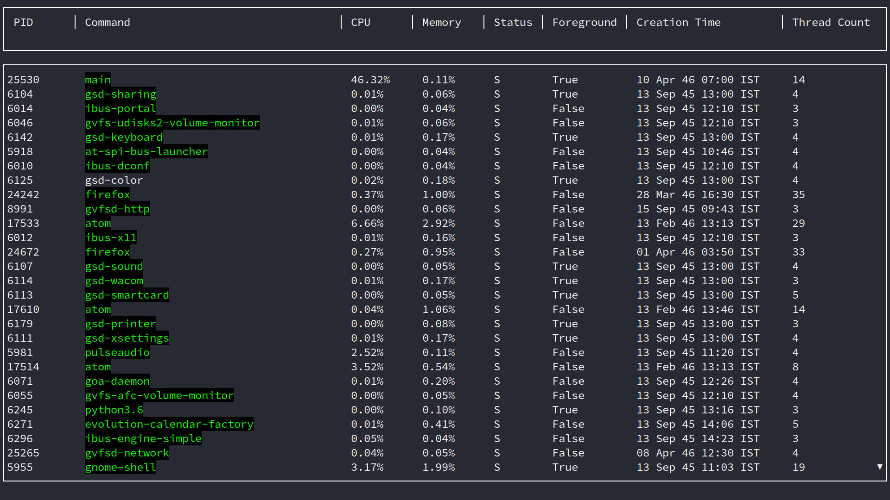
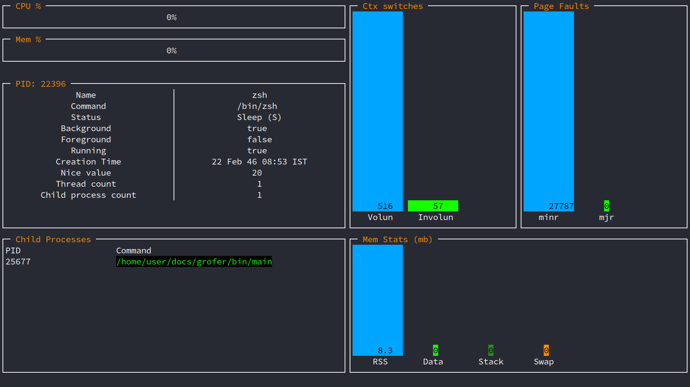

Grofer
======

A clean and good looking System Monitor and profiler written in Go!

Installation
------------

Using go get:

```
go get -u github.com/pesos/grofer
```

Building from source:

```
git clone https://github.com/pesos/grofer
cd grofer
go build main.go
```

Usage
-----

```
grofer is a system profiler written in golang

Usage:
  grofer [flags]
  grofer [command]

Available Commands:
  about       about is a command that gives information about the project in a cute way
  help        Help about any command
  proc        proc command is used to get per-process information

Flags:
      --config string   config file (default is $HOME/.grofer.yaml)
  -h, --help            help for grofer
  -t, --toggle          Help message for toggle

Use "grofer [command] --help" for more information about a command.

```

Examples
--------

### `grofer`

This gives overall utilization stats



---

### `grofer proc`

This lists all running processes and relevant information



---

### `grofer proc -p PID`

This gives information specific to a process, specified by PID


