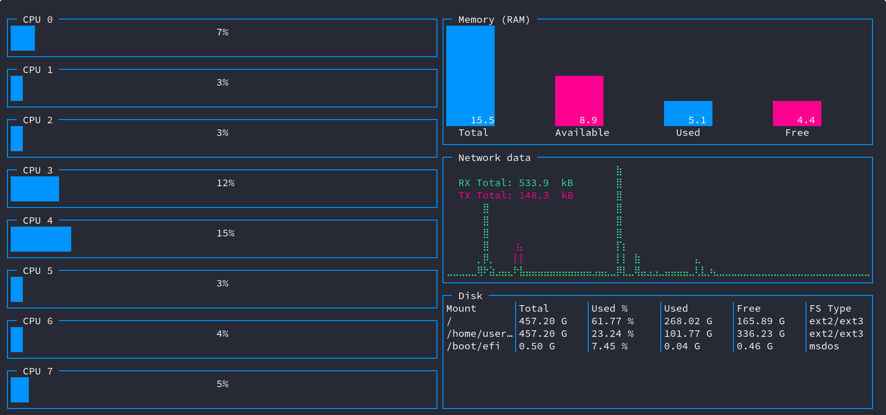
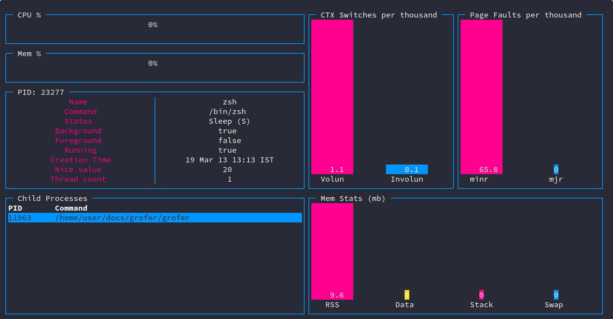
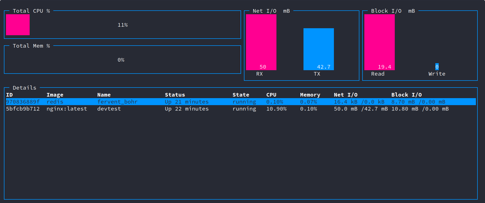

<p align="center">
  
</p>

grofer
======

[](https://github.com/pesos/grofer/actions/workflows/go-checks.yml) [](https://github.com/pesos/grofer/actions/workflows/license-check.yml) [](https://goreportcard.com/report/github.com/pesos/grofer) [](https://pkg.go.dev/github.com/pesos/grofer)

[](https://github.com/pesos/grofer/actions/workflows/docker-publish.yml)

[](https://github.com/pesos/grofer/actions/workflows/docker-publish-stable.yml)

### Latest Stable Version: 

A clean and modern system and resource monitor written purely in golang using [termui](https://github.com/gizak/termui) and [gopsutil](https://github.com/shirou/gopsutil)!

Currently compatible with Linux only.

Installation
============

Using go get:

```
go get -u github.com/pesos/grofer
```

As an executable:

```
curl -sSL https://github.com/pesos/grofer/releases/download/<version tag>/grofer_<architecture> --output grofer
chmod +x grofer
```

`architecture`: underlying system architecture on which grofer will be run  
 - grofer_386  
 - grofer_amd64  
 - grofer_arm  
 - grofer_arm64

For system wide usage, install `grofer` to a location on `$PATH`, e.g. `/usr/local/bin`

```
mv grofer /usr/local/bin
```

Building from source:

```
git clone https://github.com/pesos/grofer
cd grofer
go build grofer.go
```

### Docker

1.	Get docker image using

	```
	  docker pull ghcr.io/pesos/grofer
	```

	Note: This will use the `latest` image which is built from the stable branch.

	For previous releases, you will need to use the version number as the tag. Example: `docker pull ghcr.io/pesos/grofer:v1.2.0`

	For the latest image from the `main` branch (development image). The tag `main` can be used. Example: `docker pull ghcr.io/pesos/grofer:main`

2.	Run using

	```bash
	     docker run \
	      --name grofer \
	      --rm -it \
	      -v /:/host:ro \
	      -v /var/run/docker.sock:/var/run/docker.sock:ro \
	      --privileged \
	      --pid=host \
	      --network=host \
	      ghcr.io/pesos/grofer
	```

	Additional subcommands and flags to `grofer` can be passed directly at the end of the above command:

	```bash
	     docker run \
	      --name grofer \
	      --rm -it \
	      -v /:/host:ro \
	      -v /var/run/docker.sock:/var/run/docker.sock:ro \
	      --privileged \
	      --pid=host \
	      --network=host \
	      ghcr.io/pesos/grofer proc
	```

	```bash
	     docker run \
	      --name grofer \
	      --rm -it \
	      -v /:/host:ro \
	      -v /var/run/docker.sock:/var/run/docker.sock:ro \
	      --privileged \
	      --pid=host \
	      --network=host \
	      ghcr.io/pesos/grofer --help
	```

3.	(Optional) create an alias for `docker run` to be able to run it using just `grofer`

	```zsh
	     alias grofer="docker run \
	      --name grofer \
	      --rm -it \
	      -v /:/host:ro \
	      -v /var/run/docker.sock:/var/run/docker.sock:ro \
	      --privileged \
	      --pid=host \
	      --network=host \
	      ghcr.io/pesos/grofer"
	```

	Then use `grofer` as normal:

	```bash
	     grofer --help
	```

	```bash
	     grofer proc
	```

	Container metrics also work inside docker:

	```bash
	     grofer container
	```

#### Building Docker image

```bash
docker build -t ghcr.io/pesos/grofer .
```

---

Usage
=====

```
grofer is a system and resource monitor written in golang.

While using a TUI based command, press ? to get information about key bindings (if any) for that command.

Usage:
  grofer [flags]
  grofer [command]

Available Commands:
  about       about is a command that gives information about the project in a cute way
  completion  Generate completion script
  container   container command is used to get information related to docker containers
  export      Used to export profiled data.
  help        Help about any command
  proc        proc command is used to get per-process information

Flags:
      --config string   config file (default is $HOME/.grofer.yaml)
  -c, --cpuinfo         Info about the CPU Load over all CPUs
  -h, --help            help for grofer
  -r, --refresh uint    Overall stats UI refreshes rate in milliseconds greater than 1000 (default 1000)

Use "grofer [command] --help" for more information about a command.

```

Display Overall Metrics
-----------------------

```sh
grofer [FLAGS]
```

The command displays the default root page which provides overall CPU, Memory, Network and Disk Metrics.

Optional flags:

-	`-c | --cpuinfo`: Enabling this flag provides detailed information about CPU loads.

-	`-h | --help`: Provides help information about grofer.

-	`-r | --refresh UINT`: Sets the UI refresh rate in milliseconds. The number (UINT) provided must be greater than 1000

Display Process Metrics
-----------------------

```sh
grofer proc [FLAGS]
```

This command displays a table with information about all running processes. Additionally, it can be used to kill a running process too. Key-bindings for navigation and available process actions can be found by pressing `?` in the UI.

Optional flags:

-	`-h | --help`: Provides help details for `grofer proc`.

-	`-p | --pid INT32`: Provides in depth metrics about process identified by given PID.

-	`-r | --refresh UINT`: Sets the UI refresh rate in milliseconds. Much like the root command, this value must be greater than 1000.

Display Container Metrics
-------------------------

```sh
grofer container [FLAGS]
```

This command displays information about all existing containers. Key-bindings for navigation and available container actions can be found by pressing `?` in the UI.

Optional flags:

-	`-h | --help`: Provides help details for `grofer container`.

-	`-c | --container-id STRING`: Provides in depth metrics about the container identified by given ID.

-	`-r | --refresh UINT`: Sets the UI refresh rate in milliseconds. Much like the root command, this value must be greater than 1000.

Export Metrics
--------------

```sh
grofer export [FLAGS]
```

This command exports collected information to a specifc file format.

Optional flags:

-	`-h | --help`: Provides help details for `grofer export`.

-	`-i | --iter UINT32`: Set the number of iterations to fetch data.

-	`-p | --pid INT32`: Specify the PID of the process to profile. If not set, all processes are are measured.

-	`-t | --type STRING`: Specify the export file format. Defaults to LJSON.

-	`-f | --filename STRING`: Specify the file to store the exported data in. Defaults to `grofer_profile`.

-	`-r | --refresh UINT`: Specify frequency of data fetch in milliseconds. default value taken as 1000.

Examples
========

```
grofer
```



Information provided:  
- CPU utilization per core  
- Memory (RAM) usage  
- Network usage  
- Disk storage

---

```
grofer --cpuinfo
```

The `-c, --cpuinfo` flag displays finer details about the CPU load such as percentage of the time spent servicing software interrupts, hardware interrupts, etc.


Information provided:  
- Usr : % of time spent executing user level applications.  
- Sys : % of time spent executing kernel level processes.  
- Irq : % of time spent servicing hardware interrupts.  
- Idle : % of time CPU was idle.  
- Nice : % of time spent by CPU executing user level processes with a nice priority.  
- Iowait: % of time spent by CPU waiting for an outstanding disk I/O.  
- Soft : % of time spent by the CPU servicing software interrupts.  
- Steal : % of time spent in involuntary waiting by logical CPUs.

---

```
grofer proc
```

This lists all running processes and relevant information.


---

```
grofer proc -p PID
```

This gives information specific to a process, specified by a valid PID.

Passing a PID of 0 will list all the processes instead (same as `grofer proc`).



Information provided:

-	CPU utilization %

-	Memory utilization %

-	Child processes

-	Number of voluntary and involuntary context switches

-	Memory usage (RSS, Data, Stack, Swap)

---

```
grofer container
```

This provides overall container metrics.



---

```
grofer container -c CID
```

This provides per container metrics.


Information provided:

-	CPU and Per CPU utilization %

-	Memory utilization %

-	Container processes

-	Volume Mounts

-	Attached Networks

-	Block and Network I/O

-	Metadata (Image, Name, ID, Status, State, PID)

---

```
grofer export -i 1 -p 1
```

This allows exporting of profiled data either of system usage or data particular to that of a process. Data format is JSON by default.


---

Shell Completions
=================

`grofer` includes a subcommand to generate shell completion scripts to get autocompletion for subcommands and flags

Bash
----

To get completions for current session only,

```sh
source <(grofer completion bash)
```

To load completions for each session, the generated script must be moved to the completions directory. Take a look at the third question [here](https://github.com/scop/bash-completion/blob/master/README.md#faq) to find out the right place to put the script

Zsh
---

If shell completion is not already enabled in your environment you will need to enable it. You can execute the following once:

```sh
echo "autoload -U compinit; compinit" >> ~/.zshrc
```

To load completions for each session, the generated script must be placed in a directory in your [fpath](http://zsh.sourceforge.net/Doc/Release/Functions.html). For a quick-and-dirty solution, run once:

```sh
grofer completion zsh > "${fpath[1]}/_grofer"
```

You will need to start a new shell for this setup to take effect.

Fish
----

To get completions for current session only,

```sh
grofer completion fish | source
```

To load completions for each session, the generated script must be moved to the completions directory

```sh
grofer completion fish > ~/.config/fish/completions/grofer.fish
```

Credits
=======

-	Gopher [artwork](images/README/logo.png) credits to [Amandeep Kaur](https://instagram.com/_amankaur._)
