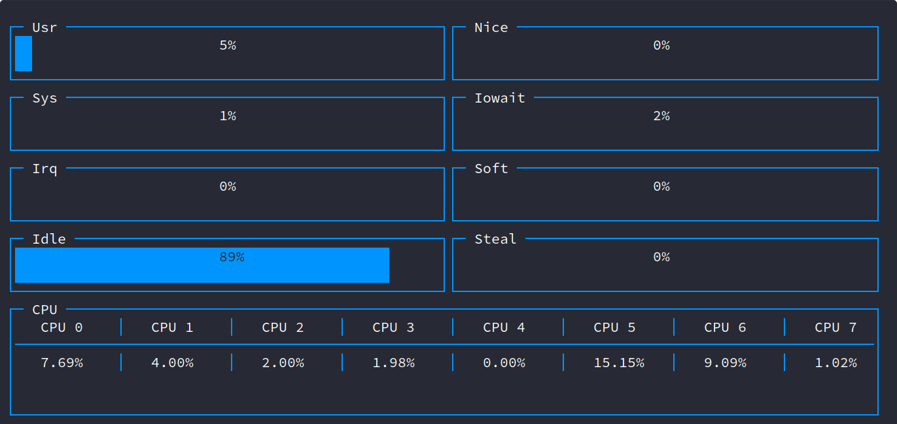
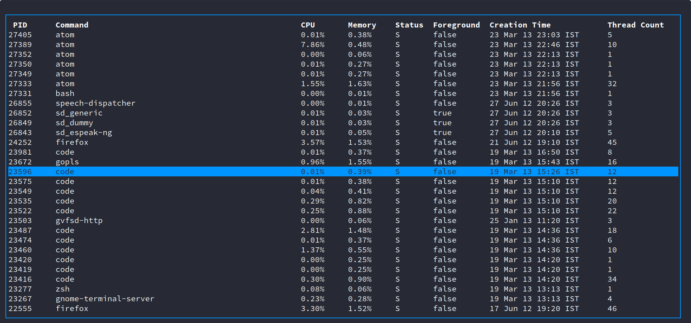

Grofer
======


A clean and modern system and resource monitor written purely in golang using [termui](https://github.com/gizak/termui) and [gopsutil](https://github.com/shirou/gopsutil)!

Currently compatible with Linux only.

Installation
------------

Using go get:

```
go get -u github.com/pesos/grofer
```

As an executable:

```
curl -sSL https://github.com/pesos/grofer/releases/download/<version tag>/grofer --output grofer
chmod +x grofer
```

For system wide usage, install `grofer` to a location on `$PATH`, e.g. `/usr/local/bin`

```
mv grofer /usr/local/bin
```

Building from source:

```
git clone https://github.com/pesos/grofer
cd grofer
go build grofer.go
```

---

Shell Completions
-----------------

`grofer` includes a subcommand to generate shell completion scripts to get autocompletion for subcommands and flags  

### Bash
To get completions for current session only,
```sh
source <(grofer completion bash)
```

To load completions for each session, the generated script must be moved to the completions directory. Take a look at the third question [here](https://github.com/scop/bash-completion/blob/master/README.md#faq) to find out the right place to put the script

### Zsh

If shell completion is not already enabled in your environment you will need to enable it. You can execute the following once:
```sh
echo "autoload -U compinit; compinit" >> ~/.zshrc
```

To load completions for each session, the generated script must be placed in a directory in your [fpath](http://zsh.sourceforge.net/Doc/Release/Functions.html). For a quick-and-dirty solution, run once:
```sh
grofer completion zsh > "${fpath[1]}/_grofer"
```

You will need to start a new shell for this setup to take effect.

### Fish

To get completions for current session only,
```sh
grofer completion fish | source
```

To load completions for each session, the generated script must be moved to the completions directory
```sh
grofer completion fish > ~/.config/fish/completions/grofer.fish
```

Usage
-----

```
grofer is a system profiler written in golang.

While using a TUI based command, press ? to get information about key bindings (if any) for that command. 

Usage:
  grofer [flags]
  grofer [command]

Available Commands:
  about       about is a command that gives information about the project in a cute way
  completion  Generate completion script
  help        Help about any command
  proc        proc command is used to get per-process information

Flags:
      --config string   config file (default is $HOME/.grofer.yaml)
  -c, --cpuinfo         Info about the CPU Load over all CPUs
  -h, --help            help for grofer
  -r, --refresh uint    Overall stats UI refreshes rate in milliseconds greater than 1000 (default 1000)
  -t, --toggle          Help message for toggle

Use "grofer [command] --help" for more information about a command.

```

---

Examples
--------

`grofer [-r refreshRate] [-c]`
------------------------------

This gives overall utilization stats refreshed every `refreshRate` milliseconds. Default and minimum value of the refresh rate is `1000 ms`.


Information provided:  
- CPU utilization per core  
- Memory (RAM) usage  
- Network usage  
- Disk storage

The `-c, --cpuinfo` flag displays finer details about the CPU load such as percentage of the time spent servicing software interrupts, hardware interrupts, etc.



Information provided:  
- Usr : % of time spent executing user level applications.  
- Sys : % of time spent executing kernel level processes.  
- Irq : % of time spent servicing hardware interrupts.  
- Idle : % of time CPU was idle.  
- Nice : % of time spent by CPU executing user level processes with a nice priority.  
- Iowait: % of time spent by CPU waiting for an outstanding disk I/O.  
- Soft : % of time spent by the CPU servicing software interrupts.
- Steal : % of time spent in involuntary waiting by logical CPUs.  

---

`grofer proc [-p PID] [-r refreshRate]`
---------------------------------------

If the `-r` flag is specified then the UI will refresh and display new information every `refreshRate` milliseconds. The minimum and default value for `refreshRate` is `1000 ms`.

### `grofer proc`

This lists all running processes and relevant information.



---

### `grofer proc -p PID`

This gives information specific to a process, specified by a valid PID.


Information provided:  
 - CPU utilization %  
 - Memory utilization %  
 - Child processes  
 - Number of voluntary and involuntary context switches  
 - Memory usage (RSS, Data, Stack, Swap)
